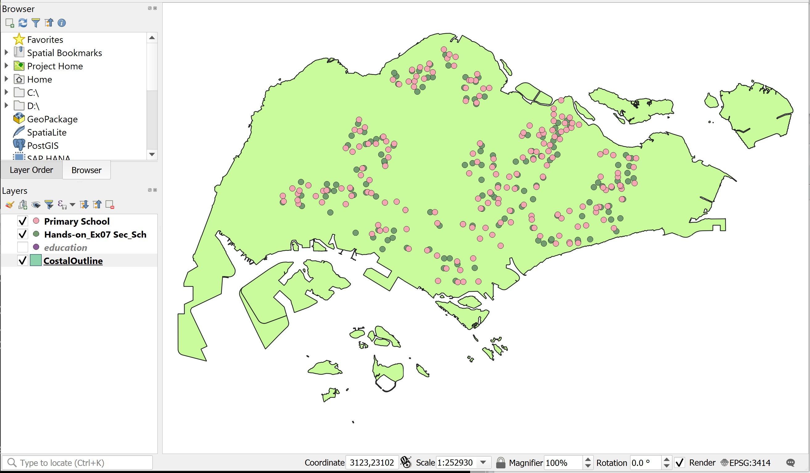

# 1.0	Introduction 

The true power of a GIS is its analytical capability.  GIS analysis functions, however, are generic and are not specifically designed for business intelligence applications.  This is particularly true when the analysis involved massive and large data.  To meet the analytical requirements and analysis efficiency of market researchers and business analysts, we need to combine appropriate GIS functions and analysis for modelling the business processes. 

This hands-on exercise consists of two major sections.  First, you will learn the basic concept of accessibility from geospatial perspective. You will also learn how to use appropriate raster GIS analyse function and mapping techniques to analyse and visualize accessibility maps. 

## 1.1	Data Preparation
  
Two GIS data are available for the analysis.  They are:

* Location of primary, secondary, mixed and JC (i.e. Education).
* Outline map of Singapore (i.e. CoastalOutline).  

### 1.1.1	Add the GIS data into QGIS Project

Before you can start to perform any analysis, you need to start a new QGIS project.  

> DIY: Using the steps you had learned from last lesson, add the Education and CoastalOutline into the newly created QGIS project. 

### 1.1.2	Using attribute query to select a subset from a master layer

The Education layer consists of locations of education institutions such as primary schools, secondary school, mixed and JC.  We are only interested on education institutions that belong to primary and secondary schools.

> DIY: Using the steps you had learned from last lesson, extract and save the primary and secondary schools in two separate GIS vector layers.    

Your screen should look similar to the figure below.



# 2.0	Raster Data Modelling

In this exercise, you will learn how to model raster data.  The exercise focusses on how to rasterise a vector GIS data layer using QGIS geoprocessing functions.   

## 2.1	Editing attribute data

In this section, you will create a new field in the attribute table of a vector GIS data and update values of the newly created field.  You will name the field as *POI_CODE*.  The data type of this data field is integer.
  
At ***~~Browser~~*** panel, right-click on the Primary Schools layer.
Select **Open Attribute Table** from the context menu.

The Attribute table dialog window of Primary Schools appears.hello test

```{r echo = FALSE, layout="l-body-outset"}
library(knitr)

emp.data <- data.frame(
   DataSource = c ("Indonesia Geospatial", "Indonesia Geospatial","Indonesia Geospatial","Indonesia Geospatial", "Indonesia Geospatial","Indonesia Geospatial","Indonesia Geospatial", "Indonesia Geospatial","Indonesia Geospatial"), 
   DataFormat = c("Shape files","Shape files","Shape files","Shape files","Shape files","Shape files","Shape files","Shape files","TIF files"),
   Description = c("OSM Buildings", "PENAJAM PASER UTARA","KUTAI KARTANEGARA", "KOTA SAMARINDA", "KOTA BALIKPAPAN","Titik Api Hotspot se-Indonesia Tahun 2014 - 2019",  "Geology Kalimantan Timur","East BATAS DESA DESEMBER 2019 DUKCAPIL KALIMANTAN TIMUR (Villiage boundary and population data for East Kalimantan 2019)", "30. Provinsi Kalimantan Timur"), 
   
   Link = c("https://www.indonesia-geospasial.com/2020/12/download-shp-pemukiman-detail-seluruh.html","https://www.indonesia-geospasial.com/2020/01/shp-rbi-provinsi-kalimantan-timur.html","https://www.indonesia-geospasial.com/2020/01/shp-rbi-provinsi-kalimantan-timur.html","https://www.indonesia-geospasial.com/2020/01/shp-rbi-provinsi-kalimantan-timur.html","https://www.indonesia-geospasial.com/2020/01/shp-rbi-provinsi-kalimantan-timur.html","https://www.indonesia-geospasial.com/2020/04/shapefile-shp-titik-api-hotspot.html
","https://www.indonesia-geospasial.com/2020/03/download-data-shapefile-shp-geologi-se.html
","https://www.indonesia-geospasial.com/2020/04/download-shapefile-shp-batas-desa.html","https://www.indonesia-geospasial.com/2020/01/download-dem-srtm-30-meter-se-indonesia.html"),
   stringsAsFactors = FALSE
)
kable(emp.data)
```

